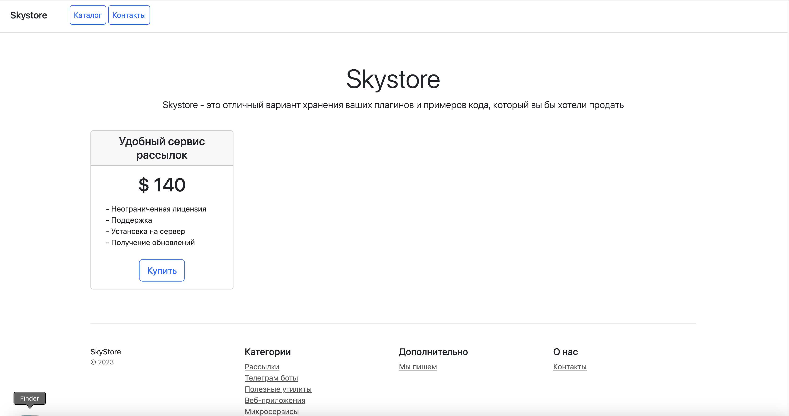
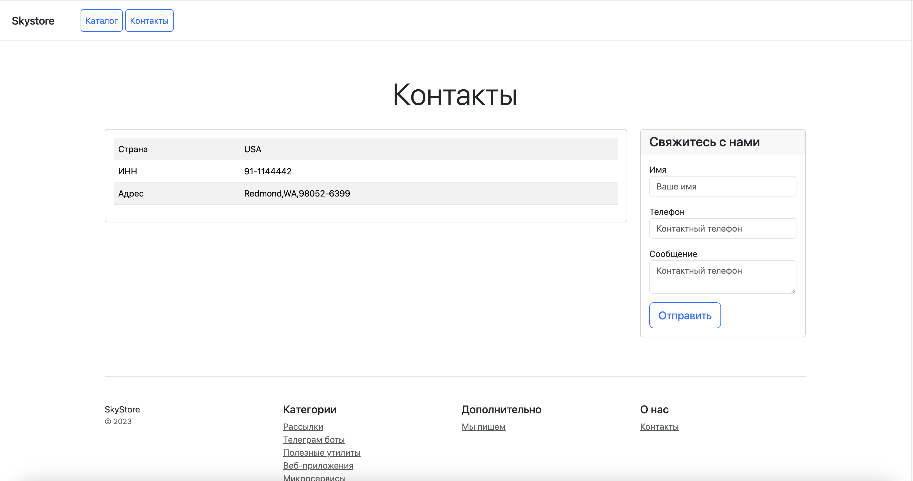

# Интернет-магазин "Skystore"


[1. Цель проекта](#title1) / 
[2. Описание HTML-шаблонов](#title2) / 
[3. Контроллеры](#title3) / 
[4. Модели](#title4) / 
[5. Админка](#title5) / 
[6. Кастомные команды](#title6) / 
[7. Установка проекта](#title7) / 
[8. Получение ключей](#title8) /


## <a id="title1">1. Цель проекта</a>
Создание проекта Django для интернет-магазина "Skystore".
Интернет-магазина для хранения разнообразных плагинов и примеров кода, который будет продаться.

1. Получить базовые навыки работы с ***Bootstrap***;
2. Получить базовые навыки работы с ***Django***.

    
## <a id="title2">2. Описание HTML-шаблонов для приложения Catalog в `media/html_patterns/`</a>
1. Файл ***media/html_patterns/Home.html***: содержит HTML-шаблон для страницы "Главная", согласно прототипа из ТЗ:



2. Файл ***media/html_patterns/Contacts.html***: содержит HTML-шаблон для страницы "Контакты", согласно прототипа из ТЗ:



   
## <a id="title3">3. Описание контроллеров (view) приложения Catalog в `catalog/views.py`</a>

1) Реализация контроллеров в модуле ***catalog/views.py***:


   - функциональный контроллер `home_page()` - контроллер для отображения домашней страницы (***home.html***):
     - Контроллер обрабатывает следующие запросы:
       - **GET-запрос**: контроллер рендерит шаблон home.html.
     - Для целей отладки контроллер выводит в консоль последние 5 созданных продуктов.


   - функциональный контроллер `contacts_page()` - контроллер для отображения страницы "Контакты" (***contacts.html***).
     - Контроллер обрабатывает следующие запросы:
       - **GET-запрос**: контроллер рендерит шаблон contacts.html;
         - при рендере шаблона GET-запрос выполняет запрос к модели ContactsData, которая хранит контактные данные интернет-магазина в БД (таблица "catalog_contacts_data") и импортирует от туда контактные данные для contacts.html;
       - **POST-запрос**: контроллер получает данные из формы (name) и возвращает простой HTTP-ответ об успешности отправки данных.


2) Настроена маршрутизация для данных контроллеров в модуле ***catalog/urls.py***.
В маршрутизации используется пространство имен app_name = CatalogConfig.name = Catalog.


## <a id="title4">4. Описание моделей (models) приложения Catalog в `сatalog/models.py`</a>

1) Реализация модели ***Category***, которая представляет категорию товаров в интернет-магазине:
   - наименование (category_name);
   - описание (description).


2) Реализация модели ***Product***, которая представляет товар в интернет-магазине:
   - наименование (product_name);
   - описание (description);
   - изображение (image);
   - категория (category);
   - цена за покупку (price);
   - дата создания (created_at);
   - дата последнего изменения (updated_at).


3) Реализация модели ***ContactsData*** для хранения контактных данных интернет-магазина:
   - страна (country);
   - ИНН (tax_id);
   - адрес (address).


## <a id="title5">5. Описание настроек админки (admin) приложения Catalog в `сatalog/admin.py`</a>

1) Для модели *"Category"* в админке настроено отображение данных (***CategoryAdmin***):
   - Отображаемые поля: "id", "category_name";
   - Поля поиска: "category_name", "description".


2) Для модели *"Product"* в админке настроено отображение данных (***ProductAdmin***):
   - Отображаемые поля: "id", "product_name", "price", "category";
   - Поля фильтрации: "category";
   - Поля поиска: "product_name", "description".


3) Для модели *ContactsData* в админке настроено отображение контактных данных (***ContactsDataAdmin***):
   - Отображаемые поля: "country", "tax_id", "address".


## <a id="title6">6. Описание кастомных команд (management/commands) приложения Catalog в `сatalog/management/commands/`</a>

1) Для модели *"Category"* созданы следующие кастомные команды:
   - `create_category_fixture.py` - кастомная команда для СОЗДАНИЯ фикстуры для модели Category;
   - `add_categories.py` - кастомная команда для ЗАГРУЗКИ данных в БД из фикстуры.


2) Для модели *"Product"* созданы следующие кастомные команды:
   - `create_product_fixture.py` - кастомная команда для СОЗДАНИЯ фикстуры для модели Product;
   - `add_products.py` - кастомная команда для ЗАГРУЗКИ данных в БД из фикстуры.


## <a id="title7">7. Установка проекта</a>
1. Клонируйте репозиторий:
```
git clone https://github.com/MaksimLakovich/Homework-4-python-DJANGO-PROJECT.git
```

2. Установите зависимости:
```
pip install -r requirements.txt
```


## <a id="title8">8. Получение ключей. Описание файла .env.example</a> 
1. Создайте файл .env в корне проекта из копии подготовленного файла `.env.example`, в котором описаны названия всех переменных, необходимых для работы приложения.
2. Замените значения переменных реальными данными.
3. В модуле `settings.py` существует секретный ключ `SECRET_KEY`, который рекомендуется в целях безопасности хранить в тайне:
4. Файл .env должен содержать данные:
   - Настройки секретного ключа проекта:
     - SECRET_KEY_FOR_PROJECT = *secret_key_here*
   - Настройки дебага (обратить внимание, что в settings.py дебаг дополнительно должен быть описан так: DEBUG = True if os.getenv('DEBUG') == 'True' else False):
     - DEBUG = True
   - Настройки БД:
     - DATABASE_SKYSTORE = *write_here*
     - DATABASE_USER = *write_here*
     - DATABASE_PASSWORD = *write_here*
     - DATABASE_HOST = *write_here*
     - DATABASE_PORT = *write_here*
